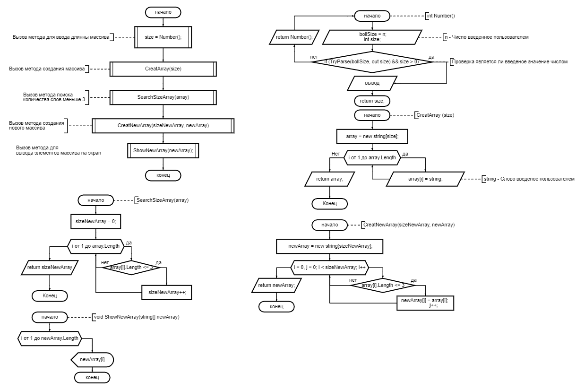

## Блок-Схема программы:

## Описание программы, которая из массива, заполненного пользователем, строк формирует массив из строк, длина которых меньше или равна 3 символам. 

1. Создаем метод, который должен возвращать длину массива.
    1. В методе пользователь должен ввести длину массива (Целое положительное число).
    2. Необходимо проверить, что пользователь ввел положительное целое число, а не символ или отрицательное. Если введен символ, слово, отрицательное число или не целое положительное число, то запросить у пользователя повторный ввод.
    3. Возвращаем длину массива, которую пользователь ввел в п.1.1.

2. Создаем метод, который должен вернуть заполненный строками массив с длинной, которую указал пользователь в п.1.
    1. Создаем новый массив, с длинной, которую пользователь указал в п.1.
    2. С использованием цикла, запрашиваем у пользователя ввод строк. Количество повторений цикла должно быть меньше введеной длины массива, указанной пользователем в п.1.
    3. Возвращаем из метода заполненный строками массив.

3. Создаем метод, который должен вернуть количство строк, длина которых меньше или равна 3 символам.
    1. Создаем новую переменную, которая равна количеству строк (элементов), длина которых меньше или равна 3 символам. Первоначально переменная равна 0 (нулю).
    2. С использованием цикла производим проверку каждой строки (элемента массива), на условие, что строка должна быть меньше или равна 3 символам. Количество повторений цикла должно быть меньше длины массива, созданного в п.2.
    3. Если условие выполняется, то переменная указанаая в п.3.1. увеличивается на 1.
    4. Возвращаем из метода переменную, указанную в п.3.1. 

4. Создаем метод, который возвращает новый массив, заполненный строками, длина которых меньше или равна 3 символам.
    1. Создаем новый массив, с дилнной, укзанной в п.3.
    2. С использованием цикла производим проверку каждой строки (элемента массива), на условие, что строка должна быть меньше или равна 3 символам. Количество повторений цикла должно быть меньше длины массива, созданного в п.2.
    3. Если условие выполняется, то вновый массив присваивается строка из массива созданного в п.2.
    4. Возвращаем новый массив, заполненный строками, длина которых меньше или равна 3 символам.

5. Создаем метод, который выведет на экран строки из массива созданного в п.4.
    1. С использованием цикла, выводим каждую строку(эллемент) массива созданного в п.4. на экран. Количество повторений цикла должно быть меньше длины массива, созданного в п.4.

6. Вызываем метод из п.1.
7. Вызываем метод из п.2. Передаем ему число вернувшееся из метода указанного в п.1.
8. Вызываем метод из п.3. Передаем ему массив вренувшийся из метода указанного в п.2.
9. Вызываем метод из п.4. Передаем ему массив вренувшийся из метода указанного в п.2. и число, которое равно количеству строк длина которых меньше или равна 3 символам.
10. Вызываем метод из п. 5. Передаем ему новый массив (созданный в п.9.).
